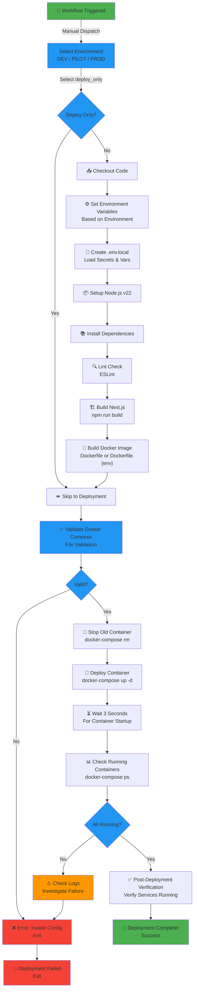

```mermaid
flowchart TD
    A["🚀 Workflow Triggered"] -->|"Manual Dispatch"| B["Select Environment<br/>DEV / PILOT / PROD"]
    B -->|"Select deploy_only"| C{"Deploy Only?"}
    
    C -->|"No"| D["📥 Checkout Code"]
    C -->|"Yes"| K["⏩ Skip to Deployment"]
    
    D --> E["⚙️ Set Environment Variables<br/>Based on Environment"]
    E --> F["📝 Create .env.local<br/>Load Secrets & Vars"]
    F --> G["📦 Setup Node.js v22"]
    G --> H["📚 Install Dependencies"]
    H --> I["🔍 Lint Check<br/>ESLint"]
    I --> J["🏗️ Build Next.js<br/>npm run build"]
    J --> L["🐳 Build Docker Image<br/>Dockerfile or Dockerfile.{env}"]
    L --> K
    
    K --> M["✅ Validate Docker Compose<br/>File Validation"]
    M --> N{"Valid?"}
    
    N -->|"No"| O["❌ Error: Invalid Config<br/>Exit"]
    N -->|"Yes"| P["🛑 Stop Old Container<br/>docker-compose rm"]
    
    P --> Q["🚢 Deploy Container<br/>docker-compose up -d"]
    Q --> R["⏳ Wait 3 Seconds<br/>For Container Startup"]
    R --> S["📊 Check Running Containers<br/>docker-compose ps"]
    S --> T{"All Running?"}
    
    T -->|"No"| U["⚠️ Check Logs<br/>Investigate Failure"]
    U --> O
    T -->|"Yes"| V["✅ Post-Deployment Verification<br/>Verify Services Running"]
    
    V --> W["🎉 Deployment Complete!<br/>Success"]
    O --> X["💥 Deployment Failed<br/>Exit"]
    
    style A fill:#4CAF50
    style W fill:#4CAF50
    style X fill:#f44336
    style O fill:#f44336
    style U fill:#ff9800
    style B fill:#2196F3
    style C fill:#2196F3
    style M fill:#2196F3
    style N fill:#2196F3
    style T fill:#2196F3
```
